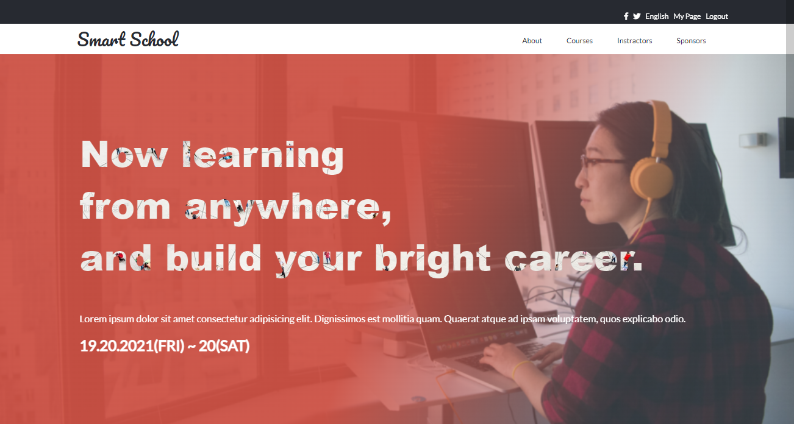
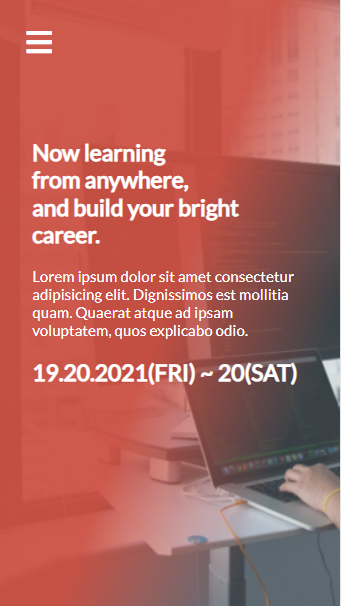

# Smart-School

> This project is my HTML & CSS Capstone Project in Microverse.
A design prototype from Cindy Shin [CC Global Summit 2015](https://www.behance.net/gallery/29845175/CC-Global-Summit-2015).

Complete design of the index, about page designed using, Flexbox, and Position alongside with other CSS concepts.

## Desktop version



## Mobile version



## Built With

- HTML
- CSS
- Javascript
- Git

## Live Demo
[Live Demo Link](https://naskhalil.github.io/Smart-School)


## Video Description
[Video Description](https://www.loom.com/)

## Getting Started

To get a local copy of the repository please run the following commands on your terminal:

```
$ cd <folder>
```

```
$ git clone https://github.com/NasKhalil/Smart-School.git
```

## Author

**Khalil Nasri**

- Github: [@NasKhalil](https://github.com/NasKhalil)
- Twitter: [@KhalilNasri92](https://twitter.com/KhalilNasri92)
- Linkedin: [Khalil](https://www.linkedin.com/in/nasri-khalil-androdev/)

## 🤝 Contributing

Contributions, issues, and feature requests are welcome!

Feel free to check the [issues page](../../issues/).

## Show your support

Give a ⭐️ if you like this project!

## Acknowledgments

- UI Design Credits goes to [Cindy Shin - CC Global Summit 2015](https://www.behance.net/gallery/29845175/CC-Global-Summit-2015)
- Project inspired by Microverse Program

## 📝 License

This project is [MIT](./MIT.md) licensed.